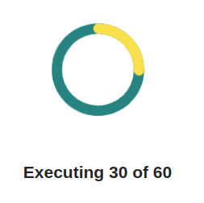
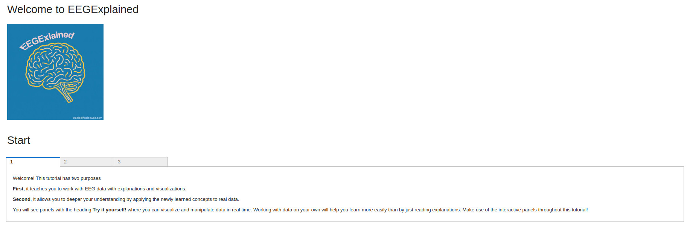

# EEGExplained 

This course teaches you the fundamentals for understanding eeg data and working with it. 


# Install

To install for the first time, execute the following commands:

## For MacOs or Linux
```
chmod u+x install.sh
chmod u+x start.sh
./install.sh
```

## For Windows

```
install.bat
```

After some time, a browser should open showing a loading bar:



The loading may take a few minutes. If the browser doesn't open by itself, go to `localhost:8866/` in your favorite browser. 

You should see the start screen: 



Start learning about EEG!
# Start

If you want to open the course from the second time on, you don't have to install everything again. Simply run: 

## MacOs & Linux
```
./start.sh
```
## Windows
```
start.bat
```

A browser window should pop up. If it does not, go to `localhost:8866/` in your favorite browser. 
You have to wait for the loading, then you should see the start screen. 


## Manual installation (for experts)

If you want to perform the installation manually or you have trouble running the aforementioned procedure, this is what needs to happen:
1) Create a virtual environment (e.g. with venv or with conda)
2) Install all requirements from the `requirements.txt`
3) Run `voila EEGExplained.ipynb`. This turns the jupyter notebook into an interactive dashboard and hosts it at `localhost:8866/`